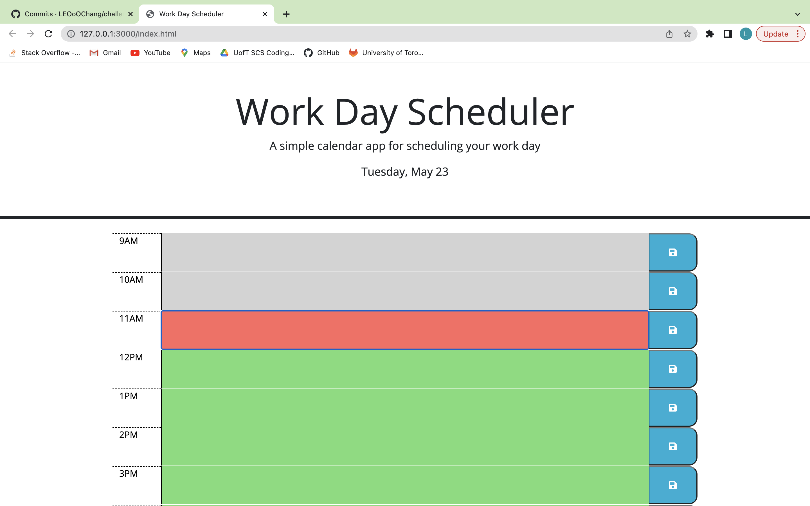
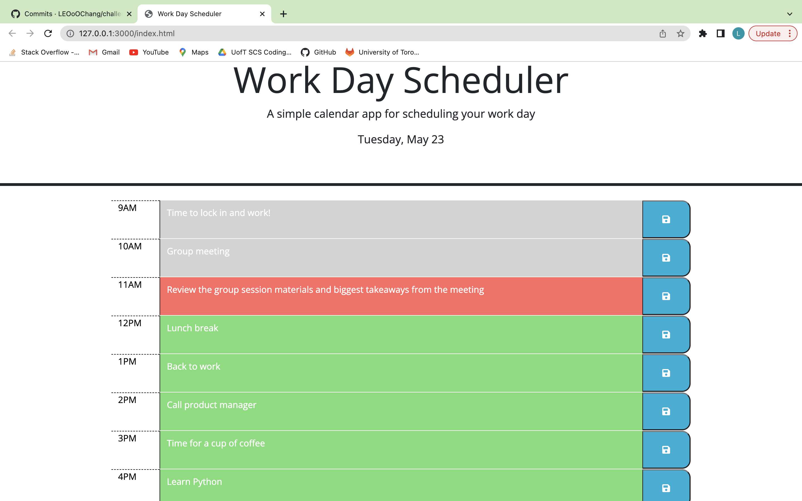

# challenge5-daily-planner

## Description

This is an everyday planning tool that helps users record and administrate tasks in different time blocks of a day. It displays present date and time and automatically updates the background color of time blocks according to current time, in order to facilitate users to swiftly recognize past, present, and/or future missions.

Furthermore, texts entered in the time blocks are securely saved and remained saved in the local storage once the save button is clicked and even the page has been refreshed, which is significantly beneficial to organizing and controlling daily what-to-do to enhance working efficiency.

## Screenshots

